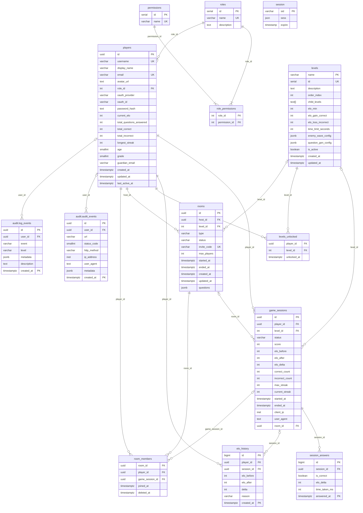

# Entity Relationship Diagram

> Generated from migrations. Supersedes 20260514_erd.md.
>
> **Changes from previous ERD:**
> - `classrooms`, `classroom_members`: removed (feature replaced by rooms; see migration `202605190002_remove_classroom.sql`)
> - `rooms`: new table (host_id, level_id, type, status, invite_code, max_players, questions, ...)
> - `room_members`: new table (room_id, player_id, game_session_id, joined_at, deleted_at)
> - `game_sessions`: `level_id` FK now nullable; `room_id` FK added

